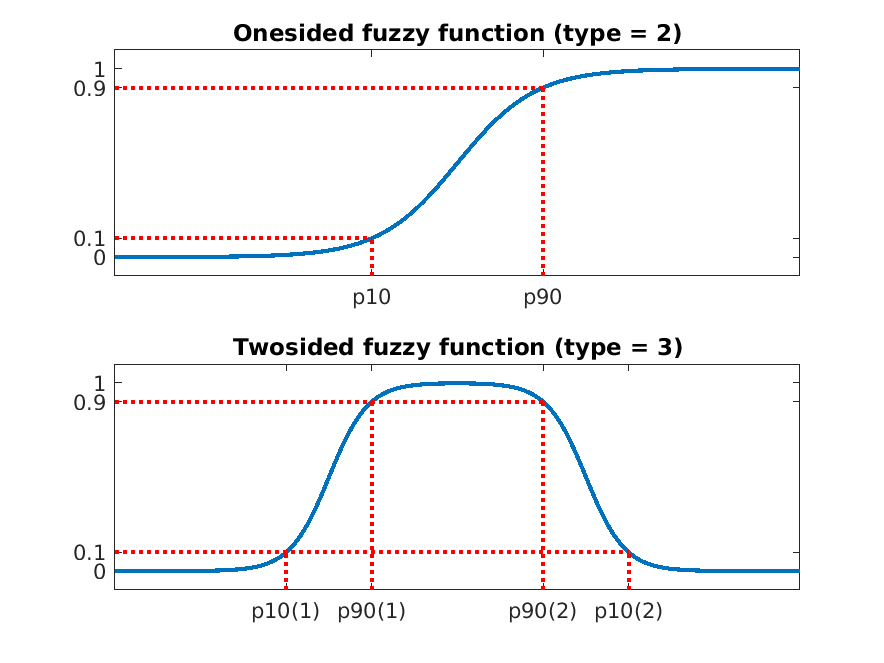

# Stochastic Optimization Framework (Matlab-Framework for Stochastic Optimization)

[[_TOC_]]

## "Installation" guide : 
- `git clone https://gitlab.tugraz.at/igte-research/stochastic-optimization-framework.git`
- `cd stochastic-optimization-framework`
- run `init.m`

This will edit the matlab startup file to include the location of the repositoty on the search path.

## Developer guide : 

After creating your own branch and editing the code please make sure you run the framework in the `TEST` mode. This will make sure that the general framework functionalities are working correctly. Meaning that no data handling errors occur and results are produced which coincide with the previosly set thresholds. For more information check out the [tests](#testing-functionality).

# Framework functionalities (OPEN TO SUGGESTIONS):
Main goal of the framework is to facilitate a ground for managing data flows and varios logging for different optimization strategies which don't even need to be in the framework itself but can be provided as external functions adhering to the framework I/O. 

## Testing functionality : 
The functionality of the framework can be tested by running the predefined tests. The goal is to be sure about the state of the code. Particularly when new functions are implemented and additional functionalities added. The tests can be performed by running : 

```matlab 
% Run tests : 
IGTEOptimizer('TEST');
```

The tests are divided into crucial framework tests and strategy convergence tests. The difference is that the crucial tests will break the execution upon not passing while the convergence tests will not break the code execution even if these dont pass. The output is also written to a report.txt file. The output for one of the tests performed will look like this : 

```txt
TEST REPORT : Differential Evolution

 - Basic functionality : PASSED !

 - Membership functionality flat : PASSED !

 - Membership functionality onesided : PASSED !

 - Membership functionality twosided : PASSED !

 - Basic convergence 1D : PASSED
   > Threshold    : 1e-8
   > Method score : 9.2409e-18   1.626e-15  1.5456e-18

 - Basic convergence 1D normalized : PASSED
   > Threshold    : 1e-8
   > Method score : 1.2189e-17  1.5932e-19  5.6413e-18

 - Basic convergence 5-D : PASSED
   > Threshold          : 0.01
   > Method best scores : 0.0055836   0.0062561     0.00668

 - Basic convergence 5-D normalized : PASSED
   > Threshold          : 0.01
   > Method best scores : 0.0027902    0.010074   0.0010688
```

## Benchmarking functionality : 
The benchmarking functionality allows the developer to pass the strategy that is being developed and to evaluate its performance. A predefined list of test problems is then optimized with the passed strategy and a report is generated for the chosen strategy as well as output to the matlab console. Benchmarking for the Firefly algorithm that is included in the framework can be started with : 

```matlab
% Define strategy : 
strategyCfg = optim.initConfigFirefly;

% Start benchmarking : 
IGTEOptimizer(strategyCfg, 'BENCHMARK');
```

The report output will look something like this for every one of the predefined test functions : 

```txt
 BENCHMARK LOG FOR : Firefly


  - Running benchmark for : Rosenbrock_test_function

    > Runtime mean    : 0.22825
    > Runtime std     : 0.09039
    > Runtime total   : 2.2825
    > Quality best    : 0
    > Quality mean    : 0.0096936
    > Quality std     : 0.030462
    > Parameters best : 1  1
    > Parameters mean : 1.0345      1.0788
    > Parameters std  : 0.097134     0.22497
```

## Optimization setup : 

To use the framework for optimization the following needs to be defined and passed to the **IGTEOptimizer** constructor.
```matlab
% Choose strategy : 
strategyCfg = optim.initConfigDE;

% Set problem config : 
problemCfg = testfun.cfgProblemRosenbrock;

optimizer = IGTEOptimizer(strategyCfg, ... 
                      'problemCfg', problemCfg);
                  
% Start optimization : 
optimizer.start();

% Show only final results : 
optimizer.finalResults
```

There are many options to be selected when creating the `IGTEOptimizer` instance. These are listed in the following table : 

| Option | Type  | Functionality | 
| :---   | :---: | :---:         |
| 'stoppingCriteria'       | `struct` | Matlab structure containing different stopping criteria as in [here](#stopping-criteria-details). | 
| 'logSelector'            | `cell`   | Cell containing the selections for logging as shown in [here](#log-selection-details). | 
| 'extPlotFun'             | `cell`   | Cell containing plot function handles. | 
| 'printFunIter'           | `handle` | Function handle to a function printing every iteration. | 
| 'printFunRun'            | `handle` | Function handle to a function printing every run. | 
| 'enablePrintIter'        | `bool`   | Enables printing to stdout on every iteration. | 
| 'enablePrintRun'         | `bool`   | Enables printing to stdout on every run. | 
| 'enablePlotting'         | `bool`   | Enables plotting functionality. | 
| 'enableDataDump'         | `bool`   | Enables saving logging data to *mat* file. | 
| 'nRuns'                  | `int`    | Number of runs to be performed with same config. | 
| 'warmStartData'          | `string` | Path to data to be used for warm start. | 
| 'plotEveryNth'           | `int`    | On every N-th iteration the plots will be updated. | 
| 'initialization'         | `string` | Type of [initialization](#initialization-details) | 
| 'saveFiguresEveryRun'    | `bool`   | When *true* saves active figures after each run. |
| 'saveFiguresEveryIter'   | `bool`   | When *true* saves active figures after each iteration. |
| 'figFormat'              | `string` | String describing the [format](#figure-format-details) in which to save the figure. | 
| 'figResolution'          | `int`    | Integer number denoting the figure [resolution](#figure-format-details). | 

### Stopping criteria details

The stopping criteria are passed as a matlab structure `stopCriteria` containing any combination of the following fields : 

| Field | Type | Meaning |
| :---  | :--- |  :---   |
| *stopCriteria.maxIter* | `int` | Maximum number of iterations to be performed. |
| *stopCriteria.maxFuncCalls* | `int` | Maximum number of function calls allowed. |
| *stopCriteria.minQual* | `float` | Minimal quality threshold. |
| *stopCriteria.maxPopulationEps* | `float` | Maximal population standard deviation. |
| *stopCriteria.maxTime* | `float` | Maximal runtime of the optimization procedure in seconds. |

### Log selection details

The log selection is done via passing a cell array containing strings as elements which denote the value to be logged. Any combination 
of the following elements is accepted. 

| Element | Type | Meaning |
| :---  | :--- |  :---   |
| *all*                 | `string` | Loggs all available values. |
| *quality*             | `string` | Selects the **quality** value for logging. |
| *parameters*          | `string` | Selects the **parameters** value for logging. |
| *objective*           | `string` | Selects the **objective** value for logging. |
| *qualityContribution* | `string` | Selects the **qualityContribution** value for logging. |
| *restValue*           | `string` | Selects the **restValue** value for logging. |

### Initialization details

It is possible to initialize the starting population using different approaches.

| Element | Type | Meaning |
| :---  | :--- |  :---   |
| *all*                 | `string` | Loggs all available values. |
| *quality*             | `string` | Selects the **quality** value for logging. |
| *parameters*          | `string` | Selects the **parameters** value for logging. |
| *objective*           | `string` | Selects the **objective** value for logging. |
| *qualityContribution* | `string` | Selects the **qualityContribution** value for logging. |
| *restValue*           | `string` | Selects the **restValue** value for logging. |

### Figure format details 

Available formats are : 

| Format |
| :---   |
| 'pdf'  |
| 'png'  |
| 'eps'  |

The resolution can be set by passing an integer value. Low quality (50-100), medium (100-200), high quality (200+).

## Membership functions : 
Definitions of fuzzy membership functions for the scalarization of multiple objectives. One needs to define a membership function for every objective of the problem. Important notice : **the optimal value is 1 and the worst value is 0** for the individual quality contributions. The quality itself (which is used for the optimization directly) is additionally converted to have the best value at *0* 
and worst at larger values. The membership functions are calculated by passing two parameters, the *10\%* and *90\%* parameters. These are used to calculate additional 
parameters which adjust the function to pass through *0.1* at *p10* and $0.9* at *p90*.

```math
c = \frac{p10 log(1/9) - p90 log(9)}{log(1/9) - log(9)}
```
```math
a = -\frac{log(9)}{p10 - c}
```

The following functions are then applied : 

- In the case of the type = 'onesided' function :
```math
\mu_i(x) = \frac{1}{1 + e^{-a(x - c)}}
```

- In the case of the type = 'twosided' function :
```math
\mu_i(x) = \frac{1}{1 + e^{-a_1(x - c_1)}} + \frac{1}{1 + e^{-a_2(x - c_2)}} - 1
```

The setup is done in the problem configuration function. Looking at the example of the `testfun.cfgTestTwoObjectiveFun` test function. One can see the following lines for the membership functions : 

```matlab

% Scalarization type :
problemConfig.scalarization = 'sum';

% Objective 1 :
problemConfig.membershipFunctions{1}.type='flat';
problemConfig.membershipFunctions{1}.k=1;
problemConfig.membershipFunctions{1}.objectivepar(1) = 1;

% Objective 2 : 
problemConfig.membershipFunctions{2}.type='onesided';
problemConfig.membershipFunctions{2}.k = 0.5;
problemConfig.membershipFunctions{2}.p10 = 0.3;
problemConfig.membershipFunctions{2}.p90 = 0.1;
problemConfig.membershipFunctions{2}.objectivepar(1) = 2;
```

First the type of scalarization needs to be chosen with `problemConfig.scalarization = sType` where `sType` can be :
- Sum of the individual contributions (sType = 1)
- Product of the individual contributions (sType = 2)
- Min of the individual contributions (sType = 3)
- Max of the individual contributions (sType = 4)

Next one needs to define the fuzzy functions for each objective. There are currently 3 types of fuzzy functions. 

- The first one (type = 1) is the bypass function $`f(x) = kx`$ which does not alter the objective value except for the multiplied coefficient $`k`$.
- The second one (type = 2) is the onesided fuzzy function with parameters $`p10`$ and $`p90`$ to set the threshold levels.
- The second one (type = 3) is the onesided fuzzy function with parameters $`p10`$ and $`p90`$ to set the threshold levels, here these parameters are arrays with length 2. 

One can also preview the selected fuzzy function for the current problem. This is done by setting : 

```matlab
problemConfig.plotMemFuns = true;
```

in the problem config function. Doing so will generate a plot of the individual fuzzy functions for the current problem setup when initializing the Optimizer object. Additionally one can 
call the function : 

```matlab 
plotMembershipFunctions(obj, extPercent)
```

which goes through all of the objectives with membership functions and plots them. *extPercent* here refers to how long to extend the previosly set range for the membership functions (just 
for nicer plots).



At the end the fuzzified contributions are condensed into a scalar value according to the selected scalarization process where additionally each contribution is multiplied by the factor $`k`$. In the case of summation of the individual fuzzy contributions one would have : 

```math
y_{scalarized} = \sum\limits_{i} k_i \mu_i(x)
```

## Optimization strategy testing :
This allows the testing of implementations of strategies. Tests currently include : 
- *Basic functionality* : Simple sanity check. One forward pass through pipeline. If **PASSED** there are no errors which might hinder the data flow but does not check strategy.
- *Basic convergence 1-D* : Checks the convergence of the strategy on the 1-D function $`x^2`$. Returns **PASSED** if in **3** runs and **50** iterations in each there is at least one quality less than 1e-8.
- *Basic convergence 5-D* : Checks the convergence of the strategy on the 5-D function sum($`x^2`$). Returns **PASSED** if in **3** runs and **100** iterations in each there is at least one quality less than 0.01.

To run the testing mode only the handle to the optimization strategy config needs to be passed : 
```matlab
% Choose strategy : 
strategyCfg = optim.initConfigFirefly;

% Run tests : 
IGTEOptimizer(strategyCfg, 'TEST');
```

## Optimization strategy benchmarking : 
Banchmarking allows running the selected strategy on different test problems with selected parameters for a number of runs and computes statistics regarding the obtained results. This way it is possible to easily compare the changes between implementations, strategies and parameters used.

```matlab
% Choose strategy : 
strategyCfg = optim.initConfigFirefly;

% Run tests : 
IGTEOptimizer(strategyCfg, 'BENCHMARK');
```
 
# General framework structure : 

## Implementation guideline : 

- Please open a new branch on which You are working
- Commiting to master branch only after "pull request"
- Please add comments throughout the implementation of any code that goes into the master branch

### Strategy template explanation : 

- **input** : *IGTEOptimizer* instance containing all needed configs.
- **output** : *IGTEOptimizer* instance containing all results.
- **logging** : (must be implemented) 
  - quality (Scalar value indicating fitness of an individual (parameter set))
  - population (parameters)
  - objectives (values calculated by the forward solver)
  - quality contribution (if there are more than one objectives this indicates how much each contributes to the total quality)
  - return value (additional return values of forward solver not needed directly for optimization)
- **iteration data** : (data from each iteration)
  - iteration number 
  
### Strategy config template : 

Required fields : 
- **name** (strategy name) [string]
- **optimizer** (implementation of the optimization strategy) [function handle]
- **nSwarm** (initial population size)

Additionally any parameters which are used by the strategy implementation internally are to be placed here as these are used as default starting values. Additionally if any of these parameters change over the course of the optimization process one needs to assign the changing parameters to the **strategyParams** structure inside the **currIter** struct as 
this contains data which is updated with every iteration and is used for the warm start of the optimization.

### Problem definition template :

What needs to be defined in the **problemConfig** structure.

- **name** (problem name) [string]
- **parameterNames** (names of the input parameters) [cell array]
- **objectiveNames** (names of the objectives) [cell array]
- **forwardSolver** (handle to solver function) [handle]
- **parMin** (parameter min values) [nObj x 1 arrays]
- **parMax** (parameter max values) [nObj x 1 arrays]
- **nObj** (number of objectives) [int]
- **nRestVals** (number of remaining outputs) [int]
- **scalarization** (how to combine individual objective qualities) [int]
    - 1 : summing up the values
    - 2 : taking the maximum
    - 3 : multiplying the values
- **membershipFunctions** (definition of fuzzy functions) [struct array]
    - **type** (one- or twosided fuzzy function) [int] 
    - **parameter** (fuzzy function parameters) [float]
    - **objectivepar** 

### Stopping criteria structure template : 
All of the following values are optional and if not provided the default parameters are set 
as shown below. These stopping criteria are constrained to one run which is one complete 
optimization pass.
- **maxIter** (maximal number of iterations to be performed) [default = 1000]
- **minQual** : 
  - **val** (quality threshold which needs to be passed) [default = inf]
  - **eps** (how much from the threshold is acceptable) [default = 0]
- **maxPopulationEps** (maximal std of population) [default = 0]
- **maxTime** (maximal time spent optimizing) [default = inf]
- **maxFuncCalls** (maximal number of function calls) [default = inf]

## Data structure hierarchy 

Just a quick reference for dev work : 

### **currIter** :

Contains : 

- **iIter** (the current iteration number)
- **objectives** ([nPop x 1] array consisting of objective values for the current population)
- **quality** ([nPop x 1] array consisting of quality values for the current population)
- **qualityContribution** ([nPop x nObj] array consisting of objective values for the current population)
- **feasibility** ([nPop x 1] array consisting of values indicating the feasibility of the current solution)
- **restValues** ([nPop x nRestVals] array consisting of additional values returned by the forward solver)
- **strategyParams** (struct) contains any strategy parameters which need to change during the optimization process, this is needed for warm start option.

### **IGTEOptimizer** instance  :
Contains :  
- **results** (main results, used to store quality over iteration and optional logging) :

  - **globalBestQuality** (always logged, best overall solution)
  - **localBestQuality** (always logged, best solution in current iteration) 
  - **clusterRad** (always logged, cluster radius of current iteration population)
  - **qualityLog** (optional logging - needs to be specifyed)
  - **parameterLog** (optional logging - needs to be specifyed)
  - **qualityContributionLog** (optional logging - needs to be specifyed)
  - **objectiveLog** (optional logging - needs to be specifyed)
  - **restValueLog** (optional logging - needs to be specifyed)

- **finalResults** (final results --> best solution overall - just for easier access) : 
  - **quality**
  - **parameter**
  - **objectives**
  - **qualityContribution** 
  - **restValues** 
  - **feasibility**

- **improvedPop** (same as **currIter** only difference is that only better solutions are replacing the worse already existing)
